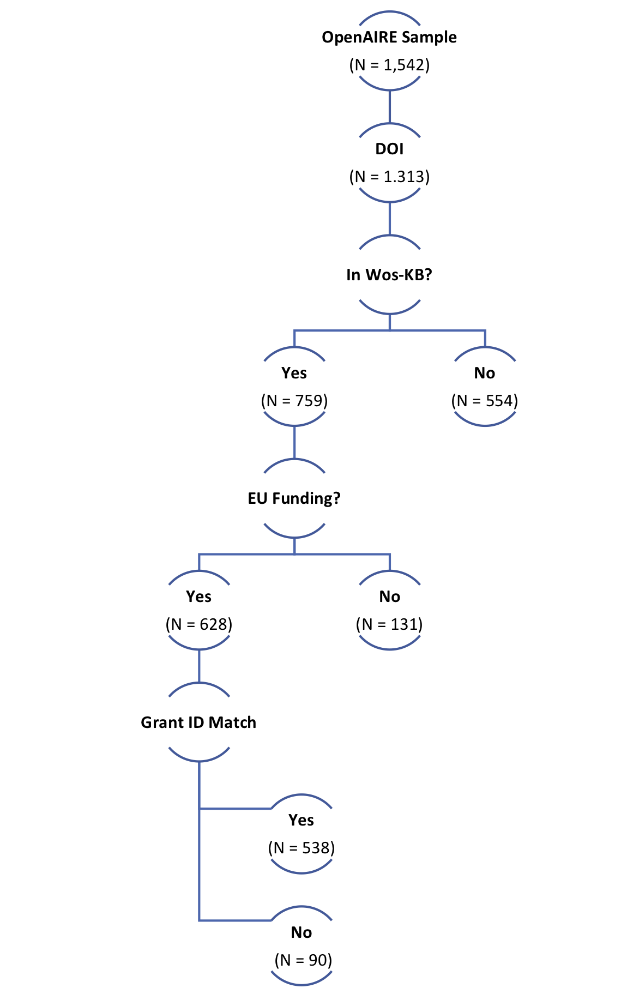

Exploration: Funding Acknowledgements from OpenAIRE in WOS-KB
================
Najko Jahn
10/7/2019

## Summary



## OpenAIRE Publications

To start with, a sample of grant-supported publications indexed in
OpenAIRE with EC-funding acknwoledgement was used. Only H2020
EC-projects with participation from the University of Göttingen were
investigated. These data were already obtained for the OpenAIRE
Institutional Dashboard Pilot:
<https://subugoe.shinyapps.io/openaire_ugoe/>

Load publications:

``` r
library(tidyverse)
library(jsonlite)
ugoe_pubs <- jsonlite::stream_in(file("data/pubs_ugoe.json"), verbose = FALSE) %>%
  as_tibble()
```

In total, the sample consists of 1542 distinct records.

For matching, the DOI article identifier is used:

``` r
ugoe_dois_df <- ugoe_pubs %>% 
  select(pid, access, openaire_project_id, openaire_id) %>% 
  unnest(cols = c(pid)) %>% 
  mutate(pid_type = ifelse(grepl("^10.", pid), "doi", NA)) %>%
  mutate(pid = tolower(pid)) %>%
  mutate(openaire_project_id = as.character(openaire_project_id))
```

In total, 1313 records have a DOI, representing a share of 85.15 %.

Store records with DOIs in separate data.frame

``` r
ugoe_dois <- ugoe_dois_df %>%
  filter(pid_type == "doi") %>%
  distinct(pid) %>%
  mutate(pid = trimws(pid))
```

Connect to WOS-KB and store data.frame in KB Table Space

``` r
require(RJDBC)
require(rJava)
.jinit()
jdbcDriver <-
  JDBC(driverClass = "oracle.jdbc.OracleDriver", classPath = "inst/jdbc_driver/ojdbc8.jar")
jdbcConnection <-
  dbConnect(
    jdbcDriver,
    "jdbc:oracle:thin:@//biblio-p-db01:1521/bibliodb01.fiz.karlsruhe",
    Sys.getenv("kb_user"),
    Sys.getenv("kb_pwd")
  ) 
```

``` r
dbWriteTable(conn = jdbcConnection, 
             name = "openaire_ugoe_dois", 
             value = ugoe_dois,
             overwrite = TRUE)
#> [1] TRUE
```

## DOI coverage in WoS-KB

Matching using Oracle SQL statement:

``` sql
select
        wos_b_2019.items.doi,
        wos_b_2019.items.doctype 
    from
        wos_b_2019.items 
    inner join
        openaire_ugoe_dois 
            on lower(wos_b_2019.items.doi) = openaire_ugoe_dois.pid
```

Summary stats

``` r
openaire_wos_doi %>%
  group_by(DOCTYPE) %>%
  summarise(n= n_distinct(DOI)) %>%
  arrange(desc(n)) 
#> # A tibble: 6 x 2
#>   DOCTYPE                n
#>   <chr>              <int>
#> 1 Article              693
#> 2 Proceedings Paper     41
#> 3 Review                20
#> 4 Correction             3
#> 5 Editorial Material     2
#> 6 Letter                 1
```

In total 759 DOIs were both indexed in OpenAIRE and Wos-KB.

## Merge with WOS-KB funding info

Oracle SQL statement to obtain funding information from WoS-KB for the
OpenAIRE-DOI-sample

``` sql
select
        wos_b_2019.fundingorganizations.fundingorganization,
        wos_b_2019.grantnumbers.grantnumber,
        wos_b_2019.items.doi 
    from
        wos_b_2019.items 
    inner join
        wos_b_2019.grantnumbers    
            on wos_b_2019.grantnumbers.fk_items = wos_b_2019.items.pk_items 
    inner join
        wos_b_2019.fundingorganizations    
            on wos_b_2019.fundingorganizations.pk_fundingorganizations = wos_b_2019.grantnumbers.fk_fundingorganizations 
    inner join
        openaire_ugoe_dois 
            on lower(wos_b_2019.items.doi) = openaire_ugoe_dois.pid
```

### Funding Organization

Identify the European Commission as funding organization using pattern
matching.

``` r
openaire_wos %>%
  as_tibble() %>%
  mutate(eu_funding = ifelse(grepl("^EU|^Eur|^ERC", FUNDINGORGANIZATION), "EU", NA)) %>% 
  filter(eu_funding == "EU") 
#> # A tibble: 1,128 x 4
#>    FUNDINGORGANIZATION              GRANTNUMBER      DOI         eu_funding
#>    <chr>                            <chr>            <chr>       <chr>     
#>  1 European ITN project (FP7-PEOPL… PITNGA-2011-289… 10.1007/JH… EU        
#>  2 European Union                   690575           10.1103/Ph… EU        
#>  3 EU                               PITN-GA-2011-28… 10.1103/Ph… EU        
#>  4 European Union                   674896           10.1103/Ph… EU        
#>  5 EU                               FP7 ITN INVISIB… 10.1103/Ph… EU        
#>  6 European Research Council under… 617143           10.1103/Ph… EU        
#>  7 European Union's Horizon resear… 690575           10.1088/14… EU        
#>  8 European Union's Horizon resear… 674896           10.1088/14… EU        
#>  9 European Union's Horizon resear… 674896           10.1007/JH… EU        
#> 10 European Union's Horizon resear… 690575           10.1007/JH… EU        
#> # … with 1,118 more rows
```

In total, 628 Web of Science records acknowledge the European Commission
as funder (`wos_b_2019.fundingorganizations.fundingorganization`).

There is a certain variation how EU support is acknowledged in
`wos_b_2019.fundingorganizations.fundingorganization`: 313 variants were
found based on our sample.

Example

``` r
openaire_wos %>%
  as_tibble() %>%
  mutate(eu_funding = ifelse(grepl("^EU|^Eur|^ERC", FUNDINGORGANIZATION), "EU", NA)) %>% 
  filter(eu_funding == "EU") %>%
  distinct(FUNDINGORGANIZATION, GRANTNUMBER) %>%
  head()
#> # A tibble: 6 x 2
#>   FUNDINGORGANIZATION                                 GRANTNUMBER          
#>   <chr>                                               <chr>                
#> 1 European ITN project (FP7-PEOPLE-ITN)               PITNGA-2011-289442-I…
#> 2 European Union                                      690575               
#> 3 EU                                                  PITN-GA-2011-289442  
#> 4 European Union                                      674896               
#> 5 EU                                                  FP7 ITN INVISIBLES   
#> 6 European Research Council under the European Union… 617143
```

### Grant Agreements

Extract EU Grant IDs, which end with a six-digit number

``` r
openaire_wos_grant <- openaire_wos %>% 
  mutate(eu_funding = ifelse(grepl("^EU|^Eur|^ERC", FUNDINGORGANIZATION), "EU", NA)) %>% 
  filter(eu_funding == "EU") %>%
  mutate(eu_grant_id = str_extract(GRANTNUMBER, "[0-9]{6,6}")) %>%
  mutate(doi = tolower(DOI)) %>%
  inner_join(ugoe_dois_df, by = c("doi" = "pid", "eu_grant_id" = "openaire_project_id"))
```

In total, 538 WoS-KB records have identical Grant IDs.

How many `GRANTNUMBER` values consists of a six-digit number:

``` r
openaire_wos %>% 
  mutate(eu_funding = ifelse(grepl("^EU|^Eur|^ERC", FUNDINGORGANIZATION), "EU", NA)) %>% 
  filter(eu_funding == "EU") %>%
  filter(grepl("^[0-9]{6,6}", GRANTNUMBER)) %>%
  as_tibble()
#> # A tibble: 858 x 4
#>    FUNDINGORGANIZATION                 GRANTNUMBER DOI           eu_funding
#>    <chr>                               <chr>       <chr>         <chr>     
#>  1 European Union                      690575      10.1103/Phys… EU        
#>  2 European Union                      674896      10.1103/Phys… EU        
#>  3 European Research Council under th… 617143      10.1103/Phys… EU        
#>  4 European Union's Horizon research … 690575      10.1088/1475… EU        
#>  5 European Union's Horizon research … 674896      10.1088/1475… EU        
#>  6 European Union's Horizon research … 674896      10.1007/JHEP… EU        
#>  7 European Union's Horizon research … 690575      10.1007/JHEP… EU        
#>  8 European Union's Horizon research … 690575      10.1007/JHEP… EU        
#>  9 European Union's Horizon research … 674896      10.1007/JHEP… EU        
#> 10 European Union's Horizon research … 674896      10.1007/JHEP… EU        
#> # … with 848 more rows
```
